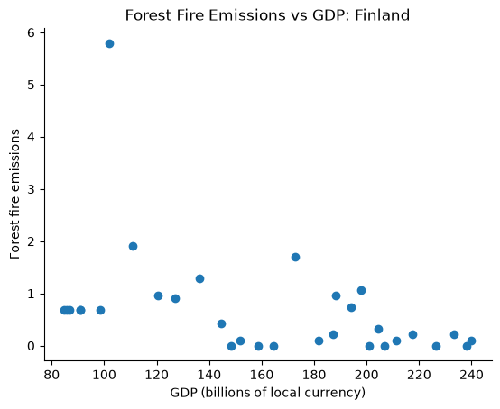
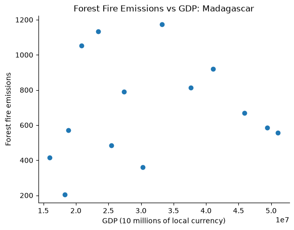
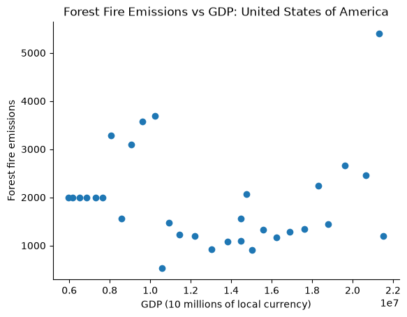

# Forest Fire Emissions and GDP

## Introduction

This project examines the relationship between forest fire emissions and GDP in Finland, Madagascar, and the United States from 1990 to 2020.

**Hypothesis:** As GDP increases, forest fire emissions will decrease because economic growth may support better infrastructure for fire prevention and management.

Each country is analyzed separately because GDP is reported in local currency.

## Results

### Finland



Finland has a few spikes in forest fire emmissions, but a minor and general downward trend as the 
GDP increases.
### Madagascar



Madagascar shows no clear relationship between GDP and forest fire emissions, with considerable emissions fluctuations.

### United States



The United States shows little relationship between GDP and forest fire emissions, with the emissions varing substantially.
### Conclusion

The hypothesis is minorly supported. Finland shows decreasing forest fire emissions with increasing GDP, while Madagascar and the United States showed no clear relationship.

Although economic growth may allow countries to improve fire management infrastructure, these results suggest that GDP alone does not explain changes in forest fire emissions.
## Methods

The analysis uses two datasets:

- `Agrofood_co2_emission.csv`: Forest fire emissions by country and year.
- `IMF_GDP.csv`: GDP by country and year.

Three functions in `src/fire_gdp.py` process the data:

- `get_data()`: Reads and filters CSV rows.
- `get_column_index()`: Finds a column by name.
- `get_fire_gdp_year_data()`: Matches forest fire emissions and GDP by country and year.

Years with missing values are excluded. The matched data is plotted using Matplotlib in `src/scatter.py`.

### Setup

Create and activate the Mamba environment:

```Bash
mamba env create -f environment.yml
mamba activate tdd
```

Check both datasets are in the `data/` folder.

They can be downloaded by running:
```Bash
curl -L "https://docs.google.com/uc?export=download&id=1AsXP_OGs1O_TDeXiZjk3fYV1SrG4vwXF" -o data/Agrofood_co2_emission.csv
curl -L "https://docs.google.com/uc?export=download&id=19YEPysdnK7VCXuAe9Og9pwYkNT5CbQzr" -o data/IMF_GDP.csv
```

### Generate Plots

Run these commands:

```Bash
mkdir -p plots
```

**Finland**

```Bash
python src/scatter.py --co2_file data/Agrofood_co2_emission.csv --gdp_file data/IMF_GDP.csv --country "Finland" --output_file plots/finland.png
```

**Madagascar**

```Bash
python src/scatter.py --co2_file data/Agrofood_co2_emission.csv --gdp_file data/IMF_GDP.csv --country "Madagascar" --output_file plots/madagascar.png
```

**United States**

```Bash
python src/scatter.py --co2_file data/Agrofood_co2_emission.csv --gdp_file data/IMF_GDP.csv --country "United States of America" --output_file plots/usa.png
```
The plots will generate into the plot folder.

## Testing

Unit tests use Python's `unittest` framework. Functional tests use `ssshtest`.

Run unit tests in Bash:

```Bash
mamba activate tdd
PYTHONPATH=src python test/unit/test_fire_gdp.py -v
```

Run functional tests in Git Bash:

```bash
bash test/func/test_fire_gdp.sh
```

GitHub Actions is configured to run the unit tests, functional tests, and style checks.

## Author

Samantha Veitch
